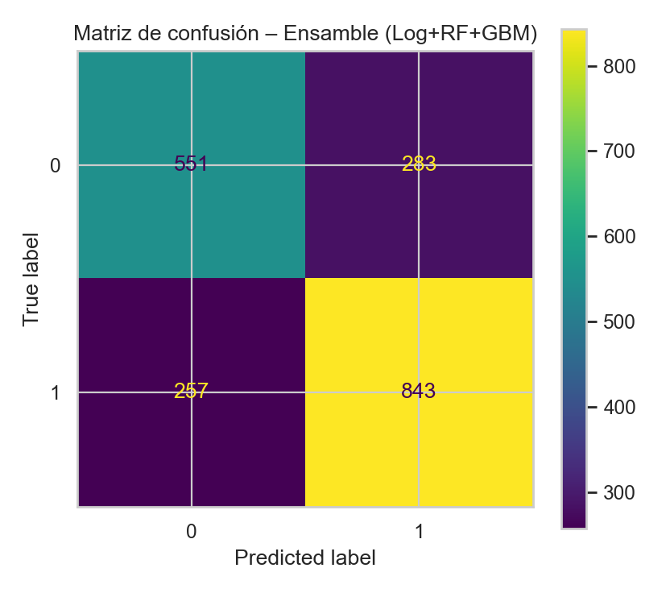
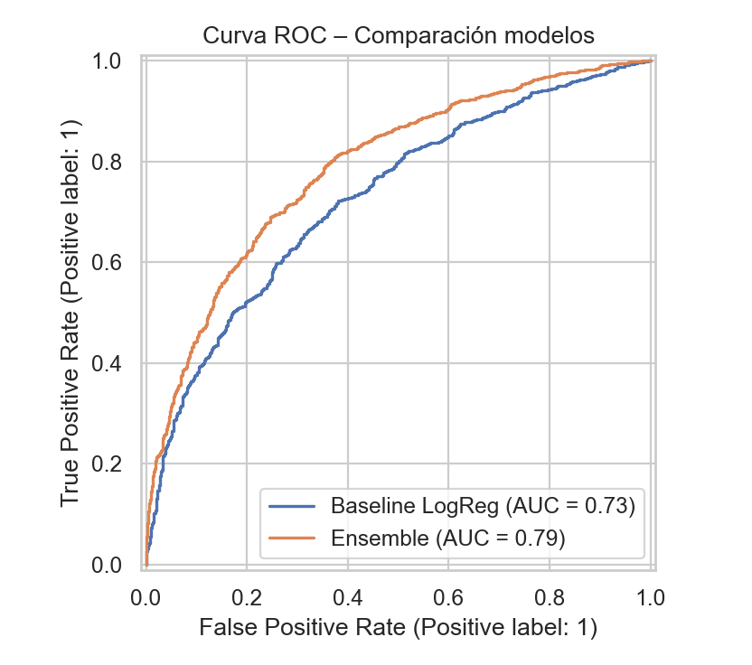

# 📱 Proyecto Play Store Rating Predictor  
**Bootcamp UDD – Proyecto Final de Ciencia de Datos**  
**Autora:** *Valentina Concha Ramírez*  
**Año:** 2025  

---

## 🧠 1. Introducción

El objetivo de este proyecto es construir un **modelo de Machine Learning** capaz de **predecir si una aplicación de Google Play Store tendrá una alta valoración por parte de los usuarios** (rating ≥ 4.3).  

Este proyecto consolida todos los contenidos del bootcamp:

- Limpieza y Exploración de Datos (EDA)  
- Procesamiento de datos numéricos y categóricos  
- Entrenamiento de modelos de Machine Learning  
- Tuning de hiperparámetros  
- Ensambles (Voting Classifier)  
- Métricas y visualización de resultados  
- Despliegue del modelo mediante una **API REST con FastAPI**

---

## 📦 2. Dataset

El dataset utilizado proviene de Kaggle:

🔗 *Google Play Store Apps*  
https://www.kaggle.com/datasets/lava18/google-play-store-apps  

Se trabajó principalmente con las siguientes variables:

- **category**
- **primary_genre**
- **content_rating**
- **price_usd**
- **installs_num**
- **size_mb**
- **reviews**
- **upd_year**
- **upd_month**
- **rating** (variable objetivo)

La clasificación final se realizó con una etiqueta binaria:

- `1` → **Aplicación con rating alto (≥ 4.3)**  
- `0` → **Aplicación con rating bajo (< 4.3)**

---

## 🔍 3. EDA y Limpieza de Datos

### Procesos realizados
- Eliminación de duplicados  
- Corrección y estandarización de tipos de datos  
- Compleción de valores faltantes (imputación por mediana)  
- Conversión de valores tipo string a numéricos (`price_usd`, `installs_num`, `size_mb`)  
- Limpieza de outliers  
- Ingeniería de features:
  - `installs_log = log1p(installs_num)`
  - `reviews_log = log1p(reviews)`

### Gráficos del EDA

**Distribución de ratings**


**Rating por categoría (Top 10 categorías)**


*(Los archivos gráficos adicionales del EDA se encuentran en la carpeta `outputs/`.)*

---

## 🤖 4. Modelos Entrenados

Se entrenaron múltiples modelos:

| Modelo | Descripción |
|--------|-------------|
| **Regresión Logística** | Modelo base y de referencia |
| **Random Forest** | Modelo basado en árboles, robusto a outliers |
| **Gradient Boosting** | Modelo basado en boosting |
| **Voting Classifier (Ensamble)** | Modelo final |

### Modelo Final

El mejor desempeño se obtuvo con un **ensamble suave (soft voting)** combinando:

- Logistic Regression  
- Random Forest  
- Gradient Boosting  

El ensamble redujo la varianza del modelo y mejoró la estabilidad de las predicciones.

---

## 🎯 5. Métricas de Rendimiento

### Matriz de confusión (modelo ensamble)



La matriz de confusión muestra que el modelo logra un buen equilibrio entre aciertos en ambas clases (alta y baja valoración), con una mayoría de verdaderos positivos y verdaderos negativos y una cantidad razonable de errores (falsos positivos y falsos negativos).

### Curva ROC – Comparación de modelos



La curva ROC compara el modelo base (Regresión Logística) con el modelo ensamble. El área bajo la curva (AUC) del ensamble es mayor, lo que indica una mejor capacidad de discriminación entre apps de alta y baja valoración.

También se calcularon métricas como:

- Accuracy  
- Precision  
- Recall  
- F1-Score  
- AUC-ROC  

---

## 🔧 6. Arquitectura del Proyecto

```bash
Proyecto_PlayStore/
│
├── data/                  # Dataset limpio
├── models/                # Modelos entrenados (.pkl / .joblib) - ignorado en GitHub
├── outputs/               # Gráficas y métricas
├── src/
│   ├── train_tabular.py   # Script de entrenamiento
│   └── serve_tabular.py   # API FastAPI
├── README.md
└── .gitignore
```

---

## 🚀 7. Entrenamiento del Modelo

Para entrenar el modelo, ejecutar:

```bash
python src/train_tabular.py
```

Esto generará:

- `models/playstore_ensemble.pkl`  
- `models/model_meta.joblib`  

---

## 🌐 8. API REST con FastAPI

La API permite recibir los features de una app y devolver una predicción binaria: `high_rating` o `low_rating`.

### Levantar la API

Desde la raíz del proyecto:

```bash
uvicorn --app-dir src serve_tabular:app --host 0.0.0.0 --port 8000
```

Abrir en navegador:

```text
http://127.0.0.1:8000/docs
```

### Ejemplo de request

```json
{
  "category": "TOOLS",
  "primary_genre": "Tools",
  "content_rating": "Everyone",
  "price_usd": 0.0,
  "installs_num": 500000,
  "size_mb": 15.0,
  "reviews": 2500,
  "upd_year": 2023,
  "upd_month": 10
}
```

### Ejemplo de respuesta

```json
{
  "prediction": "high_rating",
  "confidence": 0.85
}
```

---

## 🧪 9. (Opcional) Publicar la API con ngrok

En un notebook de Python:

```python
from pyngrok import ngrok

public_url = ngrok.connect(8000)
print("URL pública:", public_url)
```

Con esto se obtiene un enlace público temporal para probar la API desde fuera del entorno local.

---

## 🎓 10. Conclusiones

- El dataset requería un trabajo importante de limpieza y transformación de variables.  
- Los modelos basados en árboles y el ensamble superaron al modelo lineal base.  
- El modelo final presenta una buena capacidad de generalización para clasificar apps bien valoradas.  
- El proyecto integra todo el flujo de un proyecto de ciencia de datos: **EDA → Modelado → Evaluación → Despliegue (API) → Versionado en GitHub**.

---

## 🙌 11. Agradecimientos

Este proyecto fue realizado como parte del **Bootcamp de Ciencia de Datos UDD**, consolidando habilidades prácticas en análisis de datos, Machine Learning y despliegue de modelos en entornos reales.
